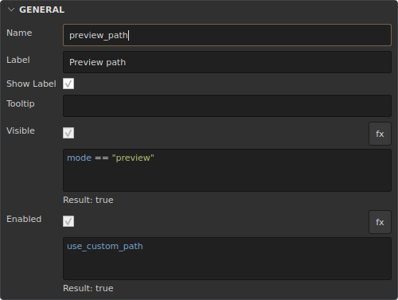

# Visible, Enabled and expressions

Every item's **GENERAL** inspector contains **Visible** and **Enabled**, both on
by default. **Name** is the unique symbolic name used by scripts and expressions;
**Label** is independent presentation text.

- Visible hides the item and releases its layout space.
- Enabled prevents user interaction, including button actions.
- **fx** switches the property to an expression. The saved checkbox value is
  retained and restored when fx is switched off.
- Hiding/disabling preserves parameter values. Scripts can still update values.
- Parent containers constrain their children. A child cannot override its parent.
- Hidden tabs lose their tab selector and page; showing restores their position.
- Linked preset edit protection remains independent.



## Try it

1. Create a checked Checkbox named `use_custom_path`.
2. Create a String named `preview_path`.
3. Enable fx for the String's Enabled property and enter `use_custom_path`.
4. Apply. Unchecking the checkbox disables the field without rebuilding the UI.
5. Use the same condition for Visible to test hiding.

The editor highlights references, keywords, strings and literals, underlines
unknown names, and completes parameter names. Hover over a reference for its type
and value. The result/error beneath the expression uses the editor's staged
document; the runtime uses active values after Apply.

## Language

```text
use_custom_path
!use_custom_path
mode == "preview"
quality >= 2
mode == "preview" && use_custom_path
mode == "preview" || mode == "render"
if draft then true else quality >= 2
```

Names refer to parameter **values**, never UI states. Scalar booleans, numbers
and strings are supported. Lists, vectors, colors and Python-script-driven toggle
states are not expression inputs.

Literals: `true`, `false`, numbers (including negative numbers), double-quoted
strings. Operators: `== != > < >= <=`, `&& || !`, parentheses, and
`if … then … else`. Precedence: `!`, comparisons, `&&`, `||`.
Boolean operators and if evaluate only the necessary branch; references are
validated when the expression is compiled.

Visible/Enabled require a boolean result. No implicit string/number conversion;
comparison types must match, and booleans are distinct from numbers. Invalid
expressions or missing parameters fall back to the saved checkbox value. Runtime
widget tooltips include diagnostics. Limits: 4096 characters and 256 tokens.

Names use ASCII letters, digits and `_`, starting with a letter or `_`.
References are case-sensitive. `if then else true false` are forbidden names in
any letter case; `if_enabled` is valid. Validation applies to the model, import
and inspector. Rename/duplicate operations rewrite expression references. Known
references are stored with stable target IDs: deleting a target does not rebind
the expression to a new item with the same name.

Expressions cannot execute Python, call functions, access files or mutate values.

## API and storage

```python
toolbox.disable("preview_path")
toolbox.enable("preview_path")
toolbox.set_enabled("preview_path", True)
toolbox.set_visible("preview_path", False)
toolbox.set_value("use_custom_path", True)
```

Presentation setters accept item names or IDs, save the checkbox state and
preserve fx for that property. Use `toolbox.item("preview_path").set(enabled=False,
enabled_expression_enabled=False)` to explicitly use the base state. Value changes
refresh dependent states. Built-in value controls synchronize in place. UI state
changes do not execute action scripts.

JSON stores the following in `ui`: `visible`, `enabled`,
`visible_expression_enabled`, `enabled_expression_enabled`, `visible_expression`,
`enabled_expression`, and ID maps `visible_references`, `enabled_references`.
Normalization and the editor maintain those maps.

Computed Value is a future step; only Visible and Enabled are exposed here.
