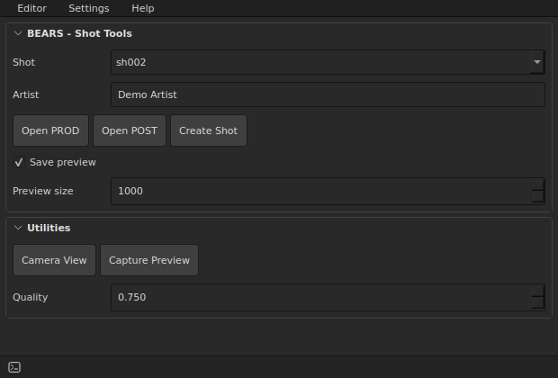
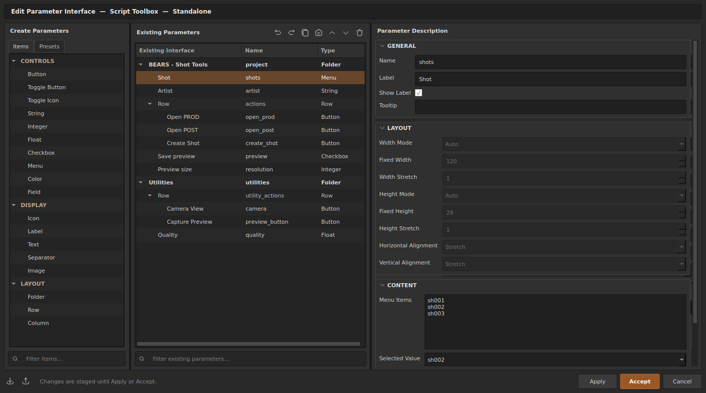
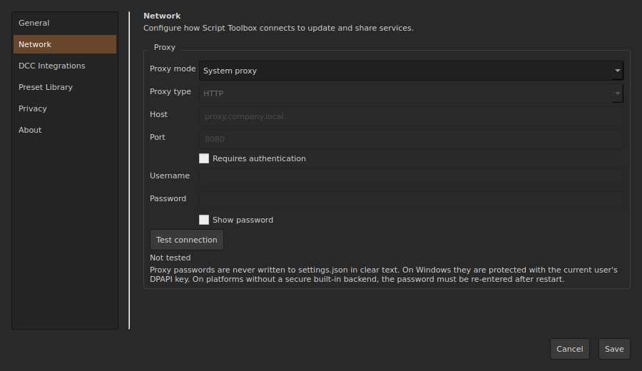
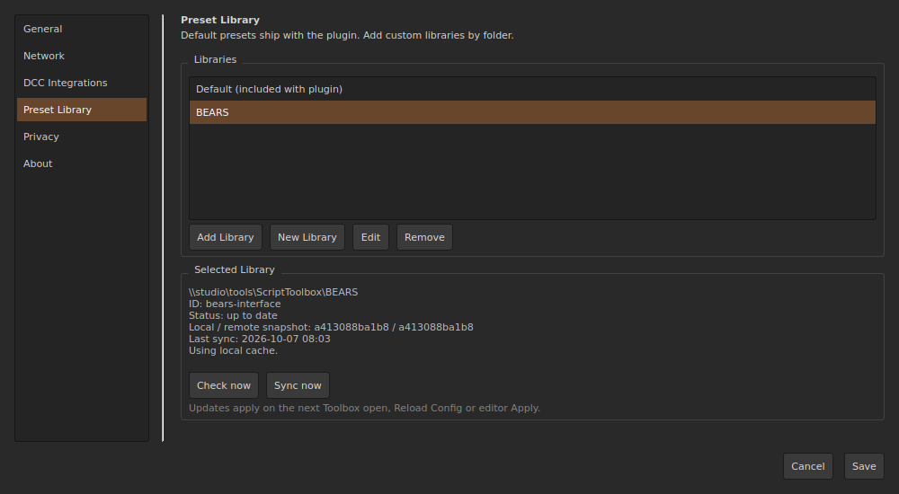
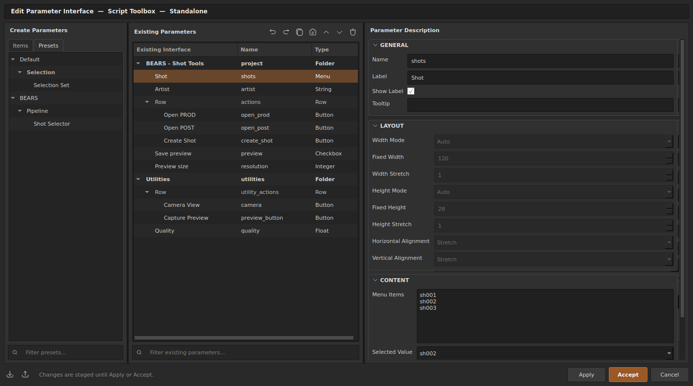

# Интерфейс и рабочий процесс

В Script Toolbox есть два взаимодополняющих режима: **Runtime**, где вы используете созданные контролы, и **Interface Editor**, где проектируете и настраиваете их.

Ниже показан настоящий интерфейс **standalone 1.1.0** с демонстрационной конфигурацией **BEARS**. Оформление окон может отличаться в Windows и внутри DCC. Нажмите на скриншот, чтобы открыть его в полном размере.

## Runtime

Runtime рендерит сохранённую конфигурацию как рабочий toolbox. Здесь выполняются обычные production-задачи: запуск действий, изменение значений, выбор объектов из Field, переключение вкладок и взаимодействие с контролами документа.

Runtime и Interface Editor используют общую модель элементов и единые renderer-контракты, поэтому поведение элементов остаётся согласованным при редактировании и использовании.

*Runtime: демонстрационный выбор шота, проектные действия и параметры превью.*

## Interface Editor

В Editor строится иерархия toolbox. Основные операции:

- создание контейнеров и контролов;
- изменение порядка и вложенности;
- настройка визуальных и поведенческих свойств;
- добавление событийных bindings и скриптов;
- дублирование переиспользуемых блоков;
- Copy/Paste элементов;
- Undo/Redo изменений документа.

*Слева — доступные типы элементов, в центре — редактируемая иерархия, справа — свойства выбранного меню Shot. Apply/Accept применяют изменения.*

## Настройки

Откройте **Settings → Open Settings**. Слева выбирается категория: General, Appearance, Network, DCC Integrations, Preset Library, Privacy или About.

В **Appearance** сверху находится компактный список тем с кнопками **+ / -**, Import, Export и Reset. Управление темой и цвета интерфейса, кода и expressions оформлены рамками Simple Folder, как на остальных страницах настроек. Цвета идут одним списком; их поля имеют одинаковую ширину и выровнены справа. Изменение цвета сразу применяется и переключает тему на **Custom**, сохраняя исходную тему. **+** создаёт именованную копию, **-** удаляет выбранную пользовательскую тему и недоступен для встроенных тем. **Save** сохраняет текущую палитру и список тем, включая изменения Custom без имени; **Cancel** отменяет добавления и удаления и возвращает исходную палитру. Import / Export обмениваются JSON-темами с версией формата, именем и цветами. Reset возвращает исходную палитру Charcoal. Формат темы 3 добавляет фон обычных кнопок с зависимыми оттенками наведения и нажатия. Кнопки items со стандартным серым цветом следуют палитре; остальные цвета items остаются локальными. Формат темы 2 включает подсветку кода и expressions, цвета структуры и текст выделения. Темы форматов 1 и 2 по-прежнему загружаются; новые цвета получают значения по умолчанию.

*Network: режим подключения, поля ручного прокси и проверка соединения.*

*Preset Library: подключённые библиотеки, выбранная папка, режим обновлений, Check now и Sync now. Сетевой путь показан как пример.*

## Структура

Перед добавлением большого количества отдельных контролов используйте контейнеры для организации интерфейса.

**Folders** задают логическую группировку. Поддерживаются варианты Collapsible, Simple, Tabs и Radio.

**Rows** располагают дочерние элементы горизонтально.

**Columns** создают колонную раскладку для более структурированных панелей.

Контейнеры можно вкладывать: Tab может содержать Rows, Row — Fields и Buttons, а Collapsible-секция — другой структурированный блок.

## Names, labels и IDs

У этих трёх понятий разные роли:

- `id` — стабильная внутренняя идентичность, используемая документом и системой ссылок;
- `name` — символическое имя для скриптов;
- `label` — текст, показываемый пользователю.

Изменение видимого label не должно считаться изменением идентичности контрола. Для обращения из скриптов используйте `name`.

## Редактирование переиспользуемых блоков

Duplicate, Copy и Paste предназначены для переиспользуемых фрагментов интерфейса. Поддерживаемые ссылки внутри дублируемой или вставляемой структуры переписываются на соответствующие новые элементы, а не остаются привязанными к исходному блоку.

Это особенно полезно для повторяющихся групп, в которых скрипты обращаются к соседним контролам.

## Presets

Палитра **Presets** содержит переиспользуемые subtrees элементов, которые можно вставлять в staged document. Presets фильтруются по активному DCC, а варианты с `dcc == "all"` доступны во всех хостах.

Встроенный preset содержит стабильные metadata (`id`, `dcc`, `category`, `label`, `description`) и обычный subtree Script Toolbox в поле `root`. При вставке subtree клонируется через тот же document controller, что используется для Duplicate и Paste: при необходимости создаются новые ID/name и переписываются поддерживаемые внутренние ссылки в скриптах.

Используйте Presets для повторяемых шаблонов инструментов, а JSON Import/Export — для переноса или архивирования полной конфигурации.

*Create Parameters → Presets: разверните библиотеку и категорию, затем вставьте пресет в Existing Parameters. Полная последовательность — в [руководстве по библиотекам](preset-libraries.md).*

## Жизненный цикл конфигурации

Editor сохраняет JSON-документ. Обычные configs используют schema **21**, а configs со связанными пресетами — schema **22** и требуют Script Toolbox 1.1.0 или новее. Другие версии и непустые configs без версии отклоняются. Автоматической миграции старых configs нет. Встроенные пресеты вставляются как локальные копии; параметры управляемых библиотек остаются связанными до преобразования в локальную копию. См. [Библиотеки пресетов](preset-libraries.md).

Пользовательская конфигурация хранится вне установленного пакета плагина и сохраняется при обновлении.
