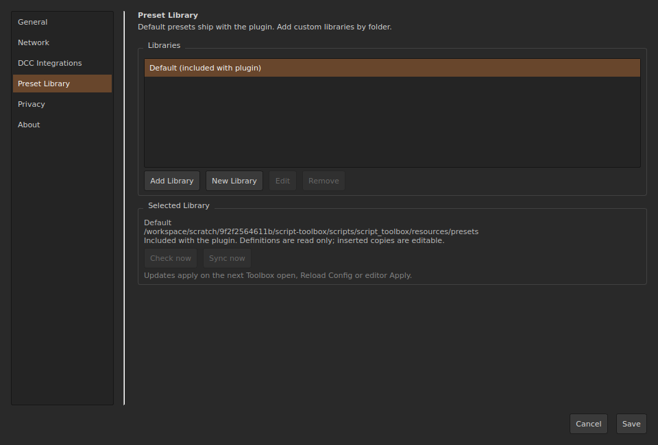
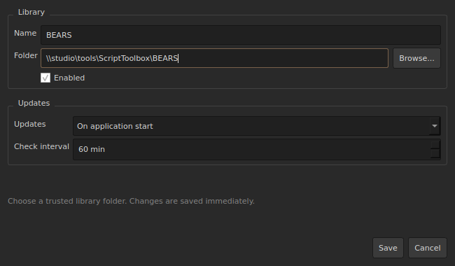
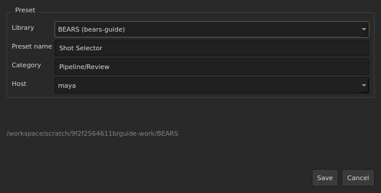
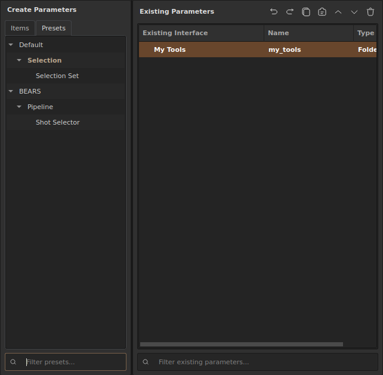

# Adding a preset library

**Version:** available in stable Script Toolbox **1.1.0 and later**.

Preset libraries store reusable presets in a local or shared network folder. This guide explains how to connect an existing library, create your own, and save your first preset using **BEARS** as an example.

Screenshots show actual standalone widgets from `dev`, commit `43ea104`. Window styling can differ on Windows and inside DCC applications. The network path is illustrative; use your own folder.

## 1. Open library settings

Choose **Settings → Open Settings**, then select **Preset Library** on the left.

| Button | Use it to |
| --- | --- |
| **Add Library** | Connect an existing folder containing `library.json` at its root. |
| **New Library** | Create a library in an empty folder. ScriptToolbox creates `library.json` and connects the library automatically. |

**Default** ships with the plugin. Create or connect a separate folder for your own library.

## 2. Connect an existing library

Click **Add Library** if a colleague has provided a library folder.

| Field | What to enter |
| --- | --- |
| **Name** | A readable name such as `BEARS`. Leave it blank to use the name from `library.json`. |
| **Folder** | The library root folder. Use **Browse…** to select the folder, not an individual preset JSON file. |
| **Enabled** | Keep checked to display the library in the catalog. |
| **Updates** | Choose an update policy from the table below. |
| **Check interval** | Minutes between checks for **Periodically**. |

For example, use `\\studio\tools\ScriptToolbox\BEARS`, with `library.json` directly inside that folder.

### Choose an update policy

| Policy | Behavior |
| --- | --- |
| **Manual** | Check and synchronize manually with **Check now** and **Sync now**. |
| **On application start** | Check and synchronize when the application starts. |
| **Periodically** | Check and synchronize at the configured interval. |

Click **Save** in the connection dialog and wait for synchronization. Adding a library automatically installs a local cached copy; an additional **Sync now** is normally unnecessary.

Connections are saved immediately. Close settings and reopen the editor after successful synchronization.

## 3. Create your own library

1. Click **New Library** in **Preset Library**.
2. Select an empty local or shared folder.
3. Enter a name such as `BEARS`.
4. Wait for creation and synchronization. The library connects automatically.

If the folder already contains `library.json`, use **Add Library** instead.

### Save your first preset

1. Choose **Editor → Open Editor**.
2. Select a parameter or a folder of parameters in **Existing Parameters**.
3. Right-click and choose **Save Selected as Preset**.

| Field | Example and purpose |
| --- | --- |
| **Library** | `BEARS` — destination library. |
| **Preset name** | `Shot Selector` — catalog display name. |
| **Category** | `Pipeline/Review` — nested categories separated by a slash. |
| **Host** | `maya` — the application the preset targets. |

Click **Save**. ScriptToolbox writes the preset and refreshes the catalog. You need write permission for the library folder.

This example produces `Maya/Pipeline/Review/Shot Selector.json`. Host and category folders are created during saving; `library.json` stays at the root.

### Choose the correct Host

| Host | Where the preset appears |
| --- | --- |
| `all` | Every supported host, including standalone. |
| `maya` | Maya. |
| `nuke` | Nuke. |
| `houdini` | Houdini. |
| `blender` | The Blender host, if available in your build. |
| `standalone` | The standalone ScriptToolbox application. |

A preset saved from standalone with `Host = maya` will be hidden in the standalone catalog. Open Maya, or save for `standalone` or `all` when its scripts are appropriate for those hosts.

## 4. Use a preset

Choose **Editor → Open Editor**, then **Create Parameters → Presets**. Expand the library and category.

The screenshot shows a separate demonstration preset, **BEARS → Pipeline → Shot Selector**, with `Host = all`.

1. Select the insertion location in **Existing Parameters**.
2. Double-click the preset in the catalog.
3. Click **Apply** or **Accept** to apply the changes.

Custom library presets are inserted as **references**: parameter definitions come from the library. A composite preset keeps its layout local. To edit a linked parameter independently, right-click it and choose **Convert to Local Copy**.

## 5. Update a library

Select the library in **Settings → Open Settings → Preset Library**.

- **Check now** checks for changes.
- **Sync now** downloads the current library to the local cache.
- **Edit** changes the folder, name, and update policy.
- **Remove** removes this application's connection; shared library files remain in place.

Updated definitions take effect on the next Toolbox open, through **Reload Config**, or through editor **Apply**. Synchronization does not immediately replace definitions in an already running interface.

When the network is unavailable, the last working local copy remains usable. The library folder must be accessible for the initial installation.

## Troubleshooting

| Problem | What to check |
| --- | --- |
| Library already connected | Select it and use **Edit**. You do not need to connect it again. |
| Folder rejected | The root must contain `library.json`. Use **New Library** for an empty folder. |
| Preset missing | Check **Enabled**, synchronization, and **Host**. Clear the **Presets** filter and reopen the editor. |
| Cannot save a preset | Check write permissions and folder availability. |
| Toolbox still shows old definitions | After synchronization, use **Apply**, **Reload Config**, or reopen Toolbox. |

For file format and synchronization details, see [Preset Library technical notes in Russian on GitHub](https://github.com/RomanKrike/script-toolbox/blob/dev/docs/PRESET_LIBRARY.ru.md).
