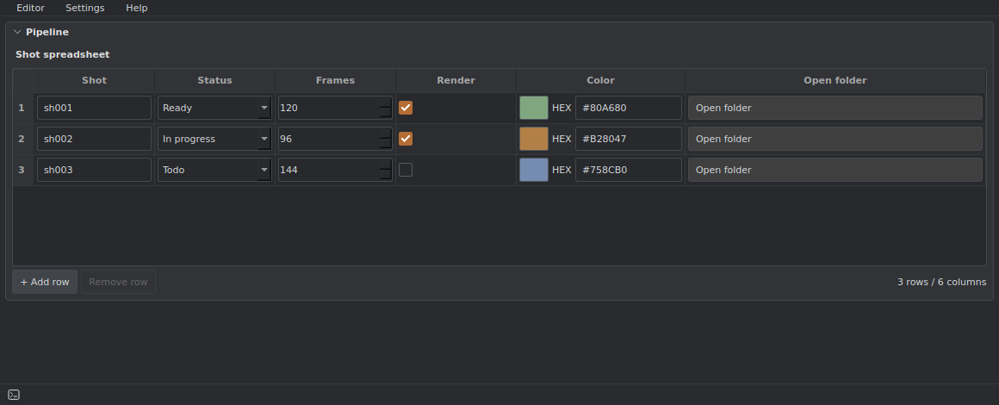
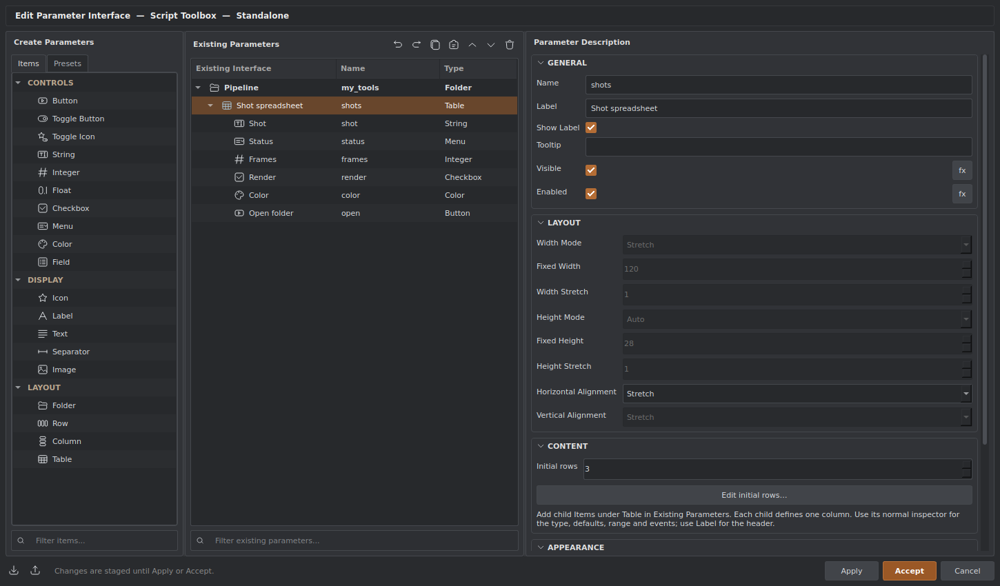

# Table / Spreadsheet

Table is a spreadsheet containing normal Item controls. Each child Item defines one column; every row uses the same control type and settings for that column. Existing Parameters shows **Table → column Items**, with no separate row or cell nodes.



## Create a table

1. Add **Table** from Create Parameters → Items → Layout.
2. Select Table in Existing Parameters and add its child Items: String, Integer, Float, Checkbox, Menu, Color, Button, Label or Icon. Drag-and-drop works too.
3. A child's **Label** becomes its column header. Its normal inspector sets the defaults, range, menu choices, color fields and events. A fixed Width sets the column width; other columns can be resized in the spreadsheet.
4. Select Table and set **Initial rows**, then use **Edit initial rows…** to enter starting data. This dialog stages a copy: Cancel discards edits, and user scripts never execute there.
5. Apply or Accept the interface. Users can edit cells and add/remove rows in the toolbox. Row data is saved with the config.



Table settings include row height, table height, row numbers, and permission to add/remove rows. Column visibility/enabled expressions apply to the whole column. Containers, selection Fields, toggles, Text and Image are not column types in this version. Sorting, filtering and formula cells are not part of the initial implementation.

## Scripts

```python
sheet = toolbox.item("shots").table()
row_id = sheet.add_row({"shot": "sh001", "frames": 120, "render": True})
sheet.set_cell(row_id, "frames", 144)
frames = sheet.get_cell(row_id, "frames")
row_data = sheet.row(row_id)
all_rows = sheet.rows
column_names = sheet.columns
sheet.remove_row(row_id)
```

Row arguments accept a stable row ID or a zero-based index. Column arguments accept an Item name, ID or zero-based index. Column numeric ranges and types validate values before committing a change. Mutations use the regular Item change/save path and refresh only the table; changing a cell keeps its editor widget alive.

Bindings on a column run for the relevant cell. In addition to the normal `toolbox`, `item`, `value`, `old_value` and `event`, they receive:

| Variable | Meaning |
| --- | --- |
| `table` | Table API handle |
| `row` | Snapshot of this row's values, keyed by column Item names |
| `row_id` | Stable row ID |
| `row_index` | Current zero-based row index |
| `column` | Column Item name |

For example, a Button column can read `row["shot"]` and open that shot's folder. Use `table.set_cell(row_id, "status", "Ready")` to change another cell. Cells are not document Items; use the table API for row data and the normal Item API for column definitions.

Column IDs keep data associated with columns after reordering or renaming. Duplicate/copy/paste generates new column and row IDs and remaps cell data. Deleting a column removes its values; editor Undo restores them. Themes apply to headers, backgrounds and embedded controls using the existing palette.

The current widget-based renderer supports up to 1,000 rows, 64 columns and 10,000 cells per table. Configs use the current universal Item schema and require a build with Table support.
